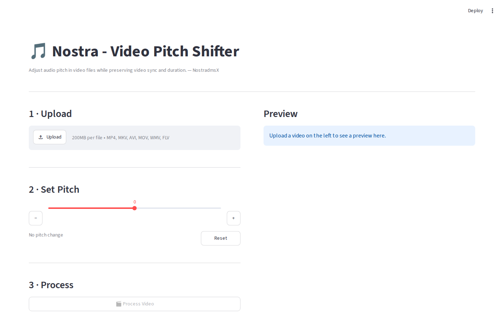

# Video Pitch Adjuster

Adjust the audio pitch of video files without re-encoding the video. Available as a **desktop GUI app** and a **browser-based web app**.

## Screenshot



*The intuitive interface allows easy video selection, pitch adjustment, and real-time processing feedback.*

---

## Versions

| | Desktop GUI | Web App |
|---|---|---|
| **File** | `video_pitch_adjuster.py` | `webapp/streamlit_app.py` |
| **Interface** | tkinter window | Browser (Streamlit) |
| **Requirements** | Python + FFMPEG | Python + FFMPEG + `streamlit` |
| **Output** | Saved to disk | Downloaded via browser |

---

## Features

- **Flexible pitch adjustment**: Adjust pitch from -20 to +20 semitones
- **Preset buttons**: Quick access to common adjustments (-1, 0, +1 semitones)
- **Real-time feedback**: Progress tracking and detailed processing logs
- **Multiple video formats**: Supports MP4, MKV, AVI, MOV, WMV, FLV
- **Auto-naming**: Automatically suggests output filenames based on pitch direction
  - Positive pitch: `filename_higher.ext`
  - Negative pitch: `filename_lower.ext`
  - Zero pitch: `filename_pitch_adjusted.ext`
- **Smart pitch engine**: Uses rubberband filter for best quality, falls back to atempo method automatically

---

## Prerequisites

### FFMPEG Installation
Both versions require FFMPEG to be installed and accessible from the command line.

#### Windows:
1. Download FFMPEG from [https://ffmpeg.org/download.html](https://ffmpeg.org/download.html)
2. Extract the files to a folder (e.g., `D:\NostraProgramFiles\ffmpeg\bin\`)

   
3. Add the `bin` folder to your system PATH:
   - Open System Properties → Advanced → Environment Variables
   - Edit the `Path` variable and add `D:\NostraProgramFiles\ffmpeg\bin\`
     - 
     - 
4. Verify installation by opening Command Prompt and running: `ffmpeg -version`

#### Mac/Linux:
```bash
# Mac (using Homebrew)
brew install ffmpeg

# Ubuntu/Debian
sudo apt update
sudo apt install ffmpeg

# CentOS/RHEL/Fedora
sudo yum install ffmpeg
# or
sudo dnf install ffmpeg
```

### Python Requirements
- Python 3.6 or higher
- tkinter (usually included with Python)

---

## Installation & Usage

### Option 1 — Desktop GUI (Offline)

No extra packages needed beyond Python and FFMPEG.

```bash
# Clone the repo
git clone https://github.com/roylouisgarcia/videopitchshifter.git
cd videopitchshifter

# Run the desktop app
python video_pitch_adjuster.py
```

**Using the desktop GUI:**

1. **Select Input Video** — Click "Browse" and select your video file
2. **Choose Output Location** — Click "Browse" or let it auto-generate a filename
3. **Adjust Pitch** — Use the slider (-20 to +20 semitones) or the preset −1 / Reset / +1 buttons
4. **Process Video** — Click "Process Video" to start
5. **Monitor Progress** — Watch the progress bar and log area for status updates

---

### Option 2 — Web App (Browser)

Runs in your browser. No desktop installation required beyond Python and FFMPEG.

```bash
# Install Streamlit
pip install streamlit

# Run the web app
streamlit run webapp/streamlit_app.py
```

Then open **http://localhost:8501** in your browser.

**Using the web app:**

1. **Upload Video** — Click the file uploader and select your video
2. **Adjust Pitch** — Use the slider or the −1 / Reset / +1 buttons
3. **Process Video** — Click the "Process Video" button
4. **Download** — A download button appears when processing is complete

#### Deploy to Streamlit Community Cloud (free hosting)

1. Push this repository to GitHub
2. Go to [share.streamlit.io](https://share.streamlit.io) and click **New app**
3. Point it at `webapp/streamlit_app.py`
4. Streamlit Cloud will automatically install `ffmpeg` from `webapp/packages.txt`

### Pitch Adjustment Guide

- **-12 semitones**: One octave lower
- **-5 semitones**: Noticeably lower pitch
- **-1 semitone**: Slight decrease
- **0 semitones**: No change (original pitch)
- **+1 semitone**: Slight increase
- **+5 semitones**: Noticeably higher pitch
- **+12 semitones**: One octave higher

## Technical Details

### Processing Steps
1. **Audio Extraction**: Extracts audio from the input video as WAV format
2. **Pitch Adjustment**: Uses FFMPEG's advanced filters to adjust pitch while preserving duration
   - First tries `rubberband` filter (best quality, maintains sync)
   - Falls back to `asetrate` + `atempo` combination if rubberband unavailable
3. **Video Merging**: Combines the pitch-adjusted audio with the original video

### FFMPEG Commands Used

#### Extract Audio:
```bash
ffmpeg -i input_video -vn -acodec pcm_s16le -ar 44100 -ac 2 extracted_audio.wav -y
```

#### Adjust Pitch (Method 1 - Rubberband, preferred):
```bash
ffmpeg -i extracted_audio.wav -af "rubberband=pitch=pitch_ratio" pitched_audio.wav -y
```

#### Adjust Pitch (Method 2 - Fallback, maintains sync):
```bash
ffmpeg -i extracted_audio.wav -af "asetrate=44100*pitch_ratio,aresample=44100,atempo=tempo_ratio" pitched_audio.wav -y
```

#### Merge Audio and Video:
```bash
ffmpeg -i input_video -i pitched_audio.wav -c:v copy -c:a aac -b:a 192k -map 0:v:0 -map 1:a:0 output_video -y
```

## Supported Formats

### Input Formats
- MP4, MKV, AVI, MOV, WMV, FLV
- Any format supported by FFMPEG

### Output Formats
- MP4 (default and recommended)
- MKV, AVI (also supported)

## Troubleshooting

### Common Issues

1. **"FFMPEG not found" error**:
   - Ensure FFMPEG is installed and added to your system PATH
   - Try running `ffmpeg -version` in command prompt/terminal

2. **Video processing fails**:
   - Check that the input video file is not corrupted
   - Ensure sufficient disk space for temporary files
   - Check the process log for detailed error messages

3. **Audio quality issues**:
   - Large pitch adjustments (>±5 semitones) may affect audio quality
   - Consider using smaller adjustments for better results
   - The app automatically tries rubberband filter for best quality

4. **Audio/Video sync issues**:
   - The app now uses advanced methods to maintain video sync
   - If sync issues persist, try smaller pitch adjustments
   - Rubberband filter provides the best sync preservation

5. **File overwrites**:
   - The app will warn you before overwriting existing files
   - Choose "No" to auto-generate a unique filename
   - Auto-generated names use format based on pitch:
     - `filename_higher_1.mp4` (for positive pitch)
     - `filename_lower_1.mp4` (for negative pitch)
     - `filename_pitch_adjusted_1.mp4` (for zero pitch)

6. **Smart filename updates**:
   - Output filename updates automatically as you adjust the pitch slider
   - Provides clear indication of the adjustment direction

7. **Slow processing**:
   - Processing time depends on video length and system performance
   - Larger videos will take longer to process

### Performance Tips

- Close other applications during processing for better performance
- Use SSD storage for faster temporary file operations
- For very large videos, consider splitting them into smaller segments

## File Structure

```
videopitchshifter/
├── video_pitch_adjuster.py      # Desktop GUI app (tkinter)
├── run_video_pitch_adjuster.bat # Windows launcher for desktop app
├── requirements.txt             # Dependency notes
├── README.md                    # This file
├── webapp/                      # Browser-based web app (Streamlit)
│   ├── streamlit_app.py         # Web app entry point
│   ├── requirements.txt         # Python dependencies (streamlit)
│   └── packages.txt             # System dependencies for Streamlit Cloud (ffmpeg)
├── images/                      # Screenshots and visual assets
│   └── screenshot.png
├── docs/                        # Documentation and configuration
│   ├── PROJECT_SUMMARY.md
│   └── config.ini
├── scripts/                     # Original shell script references
│   ├── mixback.sh
│   ├── convert2mp3.sh
│   ├── lower_automate.sh
│   └── codes.txt
└── tests/                       # Test scripts
    ├── test_pitch_methods.py
    ├── test_functionality.py
    └── test_filename_generation.py
```

## License

This project is open source and available under the MIT License.

## Contributing

Feel free to submit issues, feature requests, or pull requests to improve this application.
